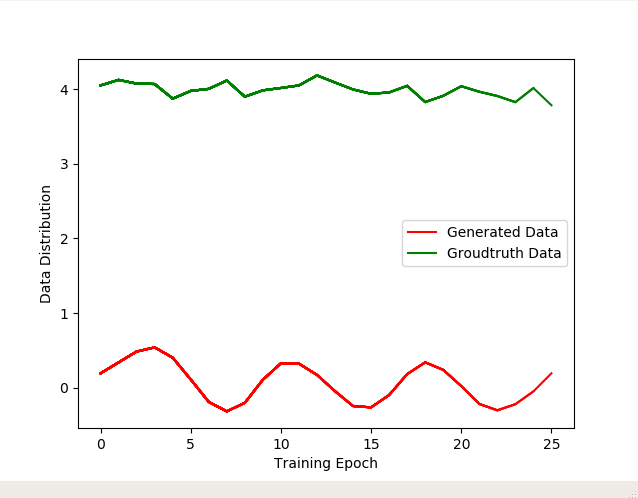

# GAN

## 50 lines of GAN
It implements a simple G and D network, where both G and D network consist of 3 fully connected layers. The training data is generated from gaussian distribution whose mean = 4 and variance = 1.25.
Here is the training curve which indicates how generated data converge to true guassian distribution. 

## WGAN-GP
Wasserstein GAN with gradient penalty

